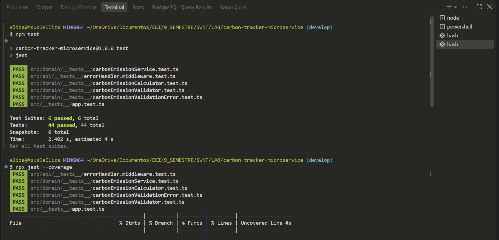
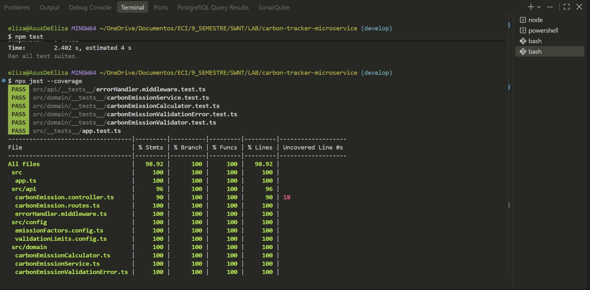
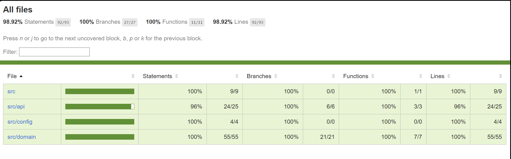

# Carbon Tracker Microservice — EcoLogistics

Microservicio de cálculo de huella de carbono para operaciones logísticas, desarrollado con **Node.js, TypeScript y Express**, como taller del curso *"Microservicio de Cálculo de Huella de Carbono con Programación asistida por la IA Generativa"* (plataforma ADA).

## Descripción

EcoLogistics necesita estimar las emisiones de CO₂ asociadas a sus operaciones de transporte según el tipo de vehículo, el peso de la carga, la distancia recorrida y la eficiencia energética del vehículo. Este repositorio contiene el microservicio (**Carbon Tracker Service**) que resuelve ese cálculo mediante una API REST.


## Tecnologías

Según lo declarado en [`package.json`](package.json):

| Tecnología | Versión | Uso |
|---|---|---|
| Node.js + TypeScript | `typescript@^5.5.0` | Lenguaje y tipado del microservicio |
| Express | `^4.19.2` | Framework HTTP / API REST |
| Jest | `^29.7.0` | Framework de pruebas |
| ts-jest | `^29.1.5` | Ejecución de pruebas TypeScript sobre Jest |
| supertest | `^7.2.2` | Pruebas de integración HTTP sobre `createApp()` |
| ts-node | `^10.9.2` | Ejecución en modo desarrollo sin compilar |
| npm | — | Gestión de dependencias y scripts |

---

## Lógica de cálculo

Fórmula consolidada durante la Fase 1 (ver [bitácora](#bitácora-completa-de-prompts), Prompt 2.1) e implementada en [`src/domain/carbonEmissionCalculator.ts`](src/domain/carbonEmissionCalculator.ts):

```text
Emisiones_CO2_kg = distanceKm × cargoWeightTons × emissionFactorBase(vehicleType) × efficiencyFactor
```

Se trata de una **estimación simplificada de emisiones operacionales asociadas al transporte**, no de una medición certificada ni de un cálculo estrictamente tanque-a-rueda o de ciclo de vida completo.

### Variables

| Variable | Tipo | Significado |
|---|---|---|
| `vehicleType` | `'ELECTRIC' \| 'DIESEL' \| 'HYBRID'` | Tipo de vehículo, único enum soportado |
| `cargoWeightTons` | `number` | Peso de la carga en toneladas |
| `distanceKm` | `number` | Distancia recorrida en kilómetros |
| `efficiencyFactor` | `number` | Multiplicador adimensional: `1.0` eficiencia estándar, `< 1.0` más eficiente, `> 1.0` menos eficiente. Debe ser estrictamente positivo |

### Factores de emisión (`src/config/emissionFactors.config.ts`)

Valores de referencia académica, **no oficiales ni certificados**, expresados en kg CO₂ por tonelada-kilómetro:

| Tipo de vehículo | Factor (kg CO₂ / ton·km) |
|---|---|
| `DIESEL` | `0.12` |
| `HYBRID` | `0.07` |
| `ELECTRIC` | `0.03` |

### Reglas de validación vigentes (`src/domain/carbonEmissionValidator.ts`)

| Situación | Resultado |
|---|---|
| `distanceKm = 0` | Válido → `0 kg CO₂` |
| `cargoWeightTons = 0` | Válido → `0 kg CO₂` |
| `distanceKm < 0` | Inválido |
| `cargoWeightTons < 0` | Inválido |
| `efficiencyFactor <= 0` | Inválido |
| Campo faltante o de tipo incorrecto (`NaN`, `Infinity`, etc.) | Inválido |
| `vehicleType` fuera de `{ELECTRIC, DIESEL, HYBRID}` | Inválido |
| Valor numérico por encima de su límite superior (ver abajo) | Inválido |

### Límites superiores (`src/config/validationLimits.config.ts`, añadidos tras el Code Review)

| Constante | Valor | Motivo (según comentario en el código) |
|---|---|---|
| `MAX_DISTANCE_KM` | `20 000` | Más que la distancia terrestre más larga posible en una sola ruta |
| `MAX_CARGO_WEIGHT_TONS` | `200` | Rango superior de carga para camiones/trenes de carga pesada |
| `MAX_EFFICIENCY_FACTOR` | `10` | El factor es un multiplicador cercano a 1.0; 10x cubre cualquier ajuste realista |

Adicionalmente, `calculateCarbonEmissionsKg` valida de forma defensiva el resultado final con `Number.isFinite(result)` y lanza un `RangeError` si no es finito, evitando responder `200 OK` con `null`. Con los límites anteriores, ningún valor permitido por el validador puede provocar overflow — esta comprobación queda como defensa adicional, no como comportamiento alcanzable hoy a través de la API pública.

---

## Decisiones de diseño

- **Node.js + TypeScript**: tipado fuerte para reducir errores en tiempo de compilación y documentar el contrato de datos del dominio.
- **Express**: framework minimalista, suficiente para un microservicio pequeño sin necesidad de un framework más pesado.
- **Jest + ts-jest + supertest**: una única herramienta para pruebas unitarias y de integración HTTP, sin dependencias adicionales de testing.
- **Separación dominio / HTTP**: `src/domain` y `src/config` no importan nada de Express; `src/api`, `src/app.ts` y `src/server.ts` son los únicos que conocen HTTP. Esto permite probar toda la lógica de negocio sin levantar un servidor.
- **Factores de emisión configurables**: aislados en `config/emissionFactors.config.ts` en vez de dispersos en el código de cálculo, y documentados explícitamente como valores de referencia académica.
- **`efficiencyFactor` como multiplicador adimensional**: decisión tomada para no atarse a una unidad de consumo específica (L/100km, kWh/km) que no estaba definida en el enunciado original.
- **Cero válido, negativos inválidos**: `distanceKm = 0` y `cargoWeightTons = 0` representan trayectos o cargas nulas, matemáticamente coherentes con la fórmula; los negativos no tienen sentido físico y se rechazan.
- **Error de dominio único con `code` + `field`** (`CarbonEmissionValidationError`) en lugar de una clase por cada causa de error: da distinción programática sin la sobreingeniería de una jerarquía de excepciones para un servicio de este tamaño.
- **Límites superiores + validación defensiva del resultado**: añadidos tras el Code Review para evitar que una entrada extrema produzca `Infinity`/`null` en una respuesta `200 OK`.
- **Middleware global de errores** (`errorHandler.middleware.ts`): traduce cualquier error no controlado a una respuesta genérica (`500`) o a un `400` para JSON malformado, sin exponer stack traces ni rutas internas; el detalle técnico se conserva solo en el log del servidor (`console.error`).
- **Sin dependencias adicionales innecesarias**: no se incorporó una base de datos, ORM, ni librerías de validación externas (Joi, Zod, etc.); las validaciones se implementaron a mano por ser reglas simples y con pocas variables.

---

## Arquitectura

```text
Cliente HTTP
     │
     ▼
server.ts  (arranque del proceso, escucha en PORT)
     │
     ▼
app.ts  (Express app: JSON middleware, montaje de rutas, errorHandler)
     │
     ▼
api/carbonEmission.routes.ts   (POST /api/carbon-emissions)
     │
     ▼
api/carbonEmission.controller.ts   (adaptador HTTP: request → dominio → response)
     │
     ▼
domain/carbonEmissionService.ts   (orquesta validación + cálculo)
     │                                   │
     ▼                                   ▼
domain/carbonEmissionValidator.ts   domain/carbonEmissionCalculator.ts
     │                                   │
     ▼                                   ▼
domain/carbonEmissionValidationError.ts   config/emissionFactors.config.ts
config/validationLimits.config.ts
```

La dependencia siempre fluye de HTTP hacia el dominio: `domain/` y `config/` no importan nada de `api/` ni de `express`. Cualquier error no capturado como `CarbonEmissionValidationError` es delegado por el controlador a `next(error)` y resuelto por `api/errorHandler.middleware.ts`, montado al final de `app.ts`.

### Responsabilidad de cada archivo

| Archivo | Responsabilidad | Capa |
|---|---|---|
| `domain/carbonEmission.types.ts` | Tipos e interfaces del dominio | Negocio |
| `domain/carbonEmissionValidationError.ts` | Clase de error de dominio y sus códigos | Negocio |
| `domain/carbonEmissionValidator.ts` | Reglas de validación de entrada | Negocio |
| `domain/carbonEmissionCalculator.ts` | Fórmula de cálculo + validación defensiva del resultado | Negocio |
| `domain/carbonEmissionService.ts` | Orquesta validación + cálculo | Negocio |
| `config/emissionFactors.config.ts` | Factores de emisión por tipo de vehículo | Configuración |
| `config/validationLimits.config.ts` | Límites superiores de entrada | Configuración |
| `api/carbonEmission.controller.ts` | Adaptador HTTP: invoca el servicio, traduce resultado/error a respuesta | HTTP |
| `api/carbonEmission.routes.ts` | Declaración de rutas Express | HTTP |
| `api/errorHandler.middleware.ts` | Middleware global de errores | HTTP |
| `app.ts` | Ensambla la app Express | HTTP |
| `server.ts` | Punto de entrada del proceso | HTTP |

---

## Estructura de carpetas

```text
carbon-tracker-microservice/
├── README.md
├── package.json
├── package-lock.json
├── tsconfig.json
├── jest.config.js
└── src/
    ├── app.ts
    ├── server.ts
    ├── __tests__/
    │   └── app.test.ts
    ├── api/
    │   ├── carbonEmission.controller.ts
    │   ├── carbonEmission.routes.ts
    │   ├── errorHandler.middleware.ts
    │   └── __tests__/
    │       └── errorHandler.middleware.test.ts
    ├── config/
    │   ├── emissionFactors.config.ts
    │   └── validationLimits.config.ts
    └── domain/
        ├── carbonEmission.types.ts
        ├── carbonEmissionCalculator.ts
        ├── carbonEmissionService.ts
        ├── carbonEmissionValidationError.ts
        ├── carbonEmissionValidator.ts
        └── __tests__/
            ├── carbonEmissionCalculator.test.ts
            ├── carbonEmissionService.test.ts
            ├── carbonEmissionValidationError.test.ts
            └── carbonEmissionValidator.test.ts
```

---

## Instalación

```bash
git clone <url-del-repositorio>
cd carbon-tracker-microservice
npm install
```

## Ejecución

Comandos definidos en `package.json` → `scripts`:

```bash
# Modo desarrollo (ts-node, sin compilar)
npm run dev

# Compilar TypeScript a dist/
npm run build

# Ejecutar la versión compilada
npm start

# Ejecutar la suite de pruebas
npm test

# Ejecutar pruebas con reporte de cobertura
npm run test:coverage
```

El servidor escucha en el puerto definido por la variable de entorno `PORT`, o `3000` por defecto (`src/server.ts`).

---

## Uso de la API

**Endpoint real:** `POST /api/carbon-emissions` (montado en `app.ts` bajo el prefijo `/api`, ruta declarada en `api/carbonEmission.routes.ts`).

Las siguientes respuestas fueron obtenidas ejecutando cada solicitud contra `createApp()` con `supertest`, no son valores inventados.

### Caso válido

```bash
curl -X POST http://localhost:3000/api/carbon-emissions \
  -H "Content-Type: application/json" \
  -d '{"vehicleType":"DIESEL","cargoWeightTons":10,"distanceKm":500,"efficiencyFactor":1}'
```

```text
HTTP 200 OK
{"emissionsKg":600}
```

### Distancia igual a cero

```bash
curl -X POST http://localhost:3000/api/carbon-emissions \
  -H "Content-Type: application/json" \
  -d '{"vehicleType":"ELECTRIC","cargoWeightTons":5,"distanceKm":0,"efficiencyFactor":1}'
```

```text
HTTP 200 OK
{"emissionsKg":0}
```

### Carga negativa

```bash
curl -X POST http://localhost:3000/api/carbon-emissions \
  -H "Content-Type: application/json" \
  -d '{"vehicleType":"HYBRID","cargoWeightTons":-5,"distanceKm":100,"efficiencyFactor":1}'
```

```text
HTTP 400 Bad Request
{"code":"NEGATIVE_VALUE","field":"cargoWeightTons","message":"cargoWeightTons must not be negative"}
```

### Vehículo no soportado

```bash
curl -X POST http://localhost:3000/api/carbon-emissions \
  -H "Content-Type: application/json" \
  -d '{"vehicleType":"GASOLINE","cargoWeightTons":10,"distanceKm":500,"efficiencyFactor":1}'
```

```text
HTTP 400 Bad Request
{"code":"UNSUPPORTED_VEHICLE_TYPE","field":"vehicleType","message":"Unsupported vehicle type: GASOLINE. Expected one of: ELECTRIC, DIESEL, HYBRID"}
```

### Valor superior al límite permitido

```bash
curl -X POST http://localhost:3000/api/carbon-emissions \
  -H "Content-Type: application/json" \
  -d '{"vehicleType":"DIESEL","cargoWeightTons":10,"distanceKm":20001,"efficiencyFactor":1}'
```

```text
HTTP 400 Bad Request
{"code":"VALUE_EXCEEDS_MAXIMUM","field":"distanceKm","message":"distanceKm must not exceed 20000"}
```

### JSON malformado

```bash
curl -X POST http://localhost:3000/api/carbon-emissions \
  -H "Content-Type: application/json" \
  -d 'not-json{{{'
```

```text
HTTP 400 Bad Request
{"message":"Malformed JSON payload"}
```

Ni el stack trace ni rutas internas del servidor se exponen en la respuesta; el middleware `errorHandler` registra el detalle técnico únicamente en el log del servidor (`console.error`).

### Códigos de error de dominio

| `code` | Cuándo se produce |
|---|---|
| `MISSING_FIELD` | Falta un campo requerido |
| `INVALID_TYPE` | El valor no es un número finito (`NaN`, `Infinity`, tipo incorrecto) |
| `UNSUPPORTED_VEHICLE_TYPE` | `vehicleType` no es `ELECTRIC`, `DIESEL` ni `HYBRID` |
| `NEGATIVE_VALUE` | `distanceKm` o `cargoWeightTons` es negativo |
| `NON_POSITIVE_EFFICIENCY_FACTOR` | `efficiencyFactor` es `0` o negativo |
| `VALUE_EXCEEDS_MAXIMUM` | Un valor numérico supera su límite configurado |

---

## Pruebas y cobertura

Framework: **Jest + ts-jest**, con pruebas de integración HTTP mediante **supertest**.

### Resultado real de la última ejecución (`npm run test:coverage`)

```text
Test Suites: 6 passed, 6 total
Tests:       44 passed, 44 total

File                               | % Stmts | % Branch | % Funcs | % Lines
------------------------------------|---------|----------|---------|--------
All files                           |   98.92 |      100 |     100 |   98.92
 src                                |     100 |      100 |     100 |     100
  app.ts                            |     100 |      100 |     100 |     100
 src/api                            |      96 |      100 |     100 |      96
  carbonEmission.controller.ts      |      90 |      100 |     100 |      90
  carbonEmission.routes.ts          |     100 |      100 |     100 |     100
  errorHandler.middleware.ts        |     100 |      100 |     100 |     100
 src/config                         |     100 |      100 |     100 |     100
 src/domain                         |     100 |      100 |     100 |     100
```

**Cobertura global: 98.92 % de statements/lines, 100 % de branches y funciones — supera el 90 % exigido por la rúbrica.**

### Evidencia visual de cobertura

**Resumen en consola (`npm test`):**



**Resumen en consola (`npm run test:coverage`):**



**Reporte HTML de cobertura:**



*Capturas generadas ejecutando `npm test` / `npm run test:coverage` y abriendo `coverage/lcov-report/index.html` en el navegador.*

### Archivos de prueba

| Archivo | Tipo | Enfoque |
|---|---|---|
| `domain/__tests__/carbonEmissionCalculator.test.ts` | Unitaria | Fórmula por tipo de vehículo, casos `0`, sensibilidad a `efficiencyFactor`, overflow a no-finito |
| `domain/__tests__/carbonEmissionValidator.test.ts` | Unitaria | Cada regla de validación (presencia, tipo, rango, límites, enum) |
| `domain/__tests__/carbonEmissionService.test.ts` | Unitaria | Orquestación validación + cálculo y propagación de errores |
| `domain/__tests__/carbonEmissionValidationError.test.ts` | Unitaria | Contrato de la clase de error de dominio |
| `api/__tests__/errorHandler.middleware.test.ts` | Unitaria (middleware) | Respuestas 500/400 genéricas sin fuga de información, delegación cuando ya se envió la respuesta |
| `src/__tests__/app.test.ts` | Integración (supertest sobre `createApp()`) | Caso válido, campo faltante, vehículo no soportado, valor sobre el límite, JSON malformado |


La línea 18 de `api/carbonEmission.controller.ts` (la llamada `next(error)` para un error inesperado, no de dominio) no está cubierta por una prueba de integración: los límites superiores agregados tras el Code Review impiden hoy que una entrada válida por el validador llegue a producir el `RangeError` defensivo del calculador a través de la API pública, por lo que ese camino solo se ejerce indirectamente mediante la prueba unitaria de `errorHandler.middleware.test.ts` (invocando el middleware de forma directa). Se documenta explícitamente en vez de omitirlo.

### Comandos

```bash
npm test              # ejecutar toda la suite
npm run test:coverage # ejecutar la suite y generar el reporte de cobertura en coverage/
```

---

## Bitácora completa de Prompts y Desarrollo Asistido por IA

### PROMPT 1 — Contexto técnico y rol del LLM

**Fase:** Fase 1 — Diseño y Definición de Prompts.
**Técnica:** Persona / Role Prompting + Context Setting.

```text
Actúa como un Desarrollador Senior especializado en diseño y construcción de microservicios backend, con experiencia en arquitectura limpia, APIs REST, TypeScript, pruebas automatizadas y buenas prácticas de ingeniería de software.

Trabajaremos en el desarrollo de un Microservicio de Cálculo de Huella de Carbono para la empresa ficticia EcoLogistics. El objetivo del servicio será calcular emisiones de CO₂ asociadas a operaciones logísticas considerando variables como:

- Tipo de vehículo: eléctrico, diésel o híbrido.
- Peso de la carga en toneladas.
- Distancia recorrida en kilómetros.
- Factor de eficiencia del combustible o energía.

Para este proyecto utilizaremos el siguiente stack tecnológico:

- Node.js
- TypeScript
- Express.js para la construcción de la API REST.
- Jest para pruebas unitarias.
- npm para la gestión de dependencias.

Durante todo el desarrollo debes actuar como mi Pair Programmer, proponiendo soluciones técnicamente justificadas y señalando posibles problemas o mejoras cuando sea necesario.

El código generado debe seguir estos estándares:

1. Aplicar principios de Clean Code, utilizando nombres descriptivos para variables, funciones, clases y archivos.
2. Aplicar los principios SOLID cuando sean pertinentes, evitando complejidad innecesaria.
3. Mantener una clara separación de responsabilidades, especialmente entre:
   - lógica de negocio;
   - controladores;
   - rutas;
   - validación de datos;
   - manejo de errores.
4. Evitar duplicación de código y favorecer componentes reutilizables.
5. Utilizar tipado fuerte de TypeScript y evitar el uso innecesario de any.
6. Validar correctamente los datos recibidos por la API.
7. Manejar errores de manera controlada y devolver respuestas HTTP coherentes.
8. Diseñar funciones pequeñas, legibles y fáciles de probar.
9. Priorizar una solución modular, mantenible y testeable.
10. No agregar dependencias externas que no sean necesarias.
11. No asumir requisitos de negocio que no hayan sido definidos. Si falta información necesaria para tomar una decisión técnica, indícalo explícitamente.
12. Antes de implementar una decisión importante, explica brevemente su propósito y las implicaciones que puede tener en el diseño.

No generes todavía el código completo del microservicio.

Por ahora, utiliza estas instrucciones como contexto técnico y estándares de desarrollo que deberán mantenerse durante las siguientes etapas del proyecto.
```

**Objetivo:** definir el rol del LLM, el stack y los estándares que debía conservar durante todo el desarrollo.

---

### PROMPT 2 — Diseño de la lógica antes de implementar

**Fase:** Fase 1 — Diseño y Definición de Prompts.
**Técnica:** Chain-of-Thought / razonamiento estructurado.

```text
Antes de escribir cualquier línea de código, analiza y define la lógica que debería seguir el Microservicio de Cálculo de Huella de Carbono de EcoLogistics.

El cálculo debe considerar estas variables de entrada:

- Tipo de vehículo: eléctrico, diésel o híbrido.
- Peso de la carga en toneladas.
- Distancia recorrida en kilómetros.
- Factor de eficiencia del combustible o energía.

Quiero que primero desarrolles un razonamiento estructurado de alto nivel sobre cómo debería funcionar el cálculo, sin generar todavía código.

Organiza tu respuesta en los siguientes apartados:

1. Variables de entrada
   - Explica qué representa cada variable.
   - Indica qué unidad debería utilizar.
   - Señala qué validaciones mínimas necesita cada una.

2. Supuestos necesarios
   - Identifica qué información falta en el enunciado para poder calcular emisiones de CO₂ de manera coherente.
   - No inventes silenciosamente valores ni fórmulas.
   - Si necesitas proponer factores de emisión o supuestos, identifícalos claramente como decisiones de diseño.

3. Lógica de cálculo
   - Propón una fórmula general para calcular las emisiones.
   - Explica cómo debería variar el cálculo según el tipo de vehículo.
   - Indica cómo intervienen la distancia, el peso de la carga y el factor de eficiencia.

4. Tratamiento por tipo de vehículo
   - Explica por separado cómo debería abordarse:
     - vehículo diésel;
     - vehículo eléctrico;
     - vehículo híbrido.
   - Señala si cada tipo requiere factores de emisión distintos.

5. Reglas de validación
   Define qué debería ocurrir ante situaciones como:
   - distancia igual a cero;
   - distancia negativa;
   - carga igual a cero;
   - carga negativa;
   - eficiencia igual o menor que cero;
   - tipo de vehículo no soportado;
   - datos faltantes.

6. Casos de ejemplo
   Propón al menos tres ejemplos conceptuales de entrada y explica qué debería ocurrir en cada caso, sin implementar código.

7. Propuesta final de lógica
   Resume la lógica recomendada de forma clara y ordenada para que pueda utilizarse posteriormente como base para la implementación.

No escribas código, pseudocódigo ejecutable, clases, controladores ni endpoints todavía.

El objetivo de esta etapa es validar primero la lógica de negocio y los supuestos del cálculo antes de comenzar la implementación.
```

**Resultado relevante:** el análisis identificó ambigüedades en los factores de emisión, la definición de `efficiencyFactor`, el alcance de las emisiones, el tratamiento de vehículos eléctricos e híbridos, y el caso de carga cero. También propuso la fórmula base distancia × carga × factor de emisión × eficiencia.

---

### PROMPT 2.1 — Refinamiento y aprobación de la lógica

**Técnica:** Iterative Refinement aplicado al diseño.

```text
Tomando como base tu propuesta anterior, apruebo la mayor parte de la lógica planteada, pero quiero hacer algunos ajustes antes de pasar a la implementación.

Mantén como decisiones aprobadas las siguientes:

- La fórmula base será:

Emisiones_CO2_kg = distanceKm × cargoWeightTons × emissionFactorBase(vehicleType) × efficiencyFactor

- efficiencyFactor se manejará como un multiplicador adimensional:
  - 1.0 = eficiencia estándar.
  - < 1.0 = vehículo más eficiente.
  - > 1.0 = vehículo menos eficiente.

- distanceKm = 0 será válido y dará como resultado 0 kg CO₂.
- cargoWeightTons = 0 será válido y dará como resultado 0 kg CO₂.
- Valores negativos para distancia o carga serán inválidos.
- efficiencyFactor <= 0 será inválido.
- Los tipos de vehículo soportados serán únicamente:
  - ELECTRIC
  - DIESEL
  - HYBRID
- Cada tipo de vehículo tendrá un factor de emisión diferente.
- Los factores de emisión serán valores configurables usados como referencia para este ejercicio académico, no se presentarán como valores oficiales o certificados.
- La solución debe mantener validaciones claras y errores explícitos para entradas inválidas.

Quiero modificar o descartar estos puntos de tu propuesta anterior:

1. No quiero manejar el alcance como estrictamente tanque-a-rueda, porque eso haría que el vehículo eléctrico tenga emisiones directas iguales a cero y complicaría innecesariamente el ejercicio.
2. En su lugar, trataremos el cálculo como una estimación simplificada de emisiones operacionales asociadas al transporte.
3. Para el vehículo eléctrico se utilizará también un factor de emisión propio, de manera similar a los otros tipos de vehículo.
4. Para el vehículo híbrido no calcularemos por separado porcentaje eléctrico y porcentaje de combustión; utilizaremos un factor de emisión híbrido específico.
5. No necesitamos investigar ni adoptar todavía factores oficiales de IPCC, EPA, DEFRA u otras fuentes. Para este ejercicio basta con factores de referencia claramente identificados como configurables.

Con estas decisiones, actualiza únicamente la propuesta final de lógica del cálculo para que quede coherente y sin contradicciones.

No escribas código todavía. No generes clases, controladores, rutas ni estructura de carpetas. Solo entrégame la versión consolidada de la lógica de negocio que utilizaremos como base para la siguiente fase.
```

**Resultado:** se consolidó la lógica definitiva antes de escribir código.

---

### PROMPT 3 — Implementación inicial

**Fase:** Fase 2 — Implementación Asistida.
**Técnica:** Zero-shot contextualizado.

```text
Ahora vamos a iniciar la fase de implementación.

Toma como base la lógica de negocio que ya consolidamos:

Emisiones_CO2_kg = distanceKm × cargoWeightTons × emissionFactorBase(vehicleType) × efficiencyFactor

Variables de entrada:

- vehicleType: ELECTRIC, DIESEL o HYBRID.
- cargoWeightTons: peso de la carga en toneladas.
- distanceKm: distancia recorrida en kilómetros.
- efficiencyFactor: multiplicador adimensional de eficiencia.

Reglas ya aprobadas:

- distanceKm = 0 es válido.
- cargoWeightTons = 0 es válido.
- Valores negativos de distancia o carga son inválidos.
- efficiencyFactor debe ser mayor que 0.
- Solo existen los tipos ELECTRIC, DIESEL y HYBRID.
- Cada tipo de vehículo debe utilizar un factor de emisión diferente.
- Los factores de emisión son valores configurables de referencia académica, no factores oficiales o certificados.

Utilizando Node.js y TypeScript, crea únicamente la función principal de cálculo de emisiones de CO₂.

Para esta primera versión:

1. Define tipos de TypeScript adecuados para representar los datos de entrada.
2. Define los tipos de vehículo soportados.
3. Define valores de referencia simples para los factores de emisión de ELECTRIC, DIESEL y HYBRID.
4. Implementa la fórmula de cálculo.
5. Mantén la función pequeña, legible y fácil de probar.
6. Utiliza nombres descriptivos.
7. Evita el uso de any.
8. Explica brevemente las decisiones tomadas.

En esta primera iteración no busques todavía crear un sistema avanzado de validación o manejo de errores. Incluye únicamente las validaciones básicas que consideres indispensables.

No generes todavía:

- Controladores.
- Rutas de Express.
- Servidor HTTP.
- Estructura completa del microservicio.
- Pruebas unitarias.

El objetivo es obtener una primera versión funcional de la lógica de cálculo que después refinaremos mediante Iterative Refinement.
```

---

### PROMPT 4 — Refinamiento de validación

**Técnica:** Iterative Refinement.

```text
Revisa la primera versión de la función de cálculo que acabas de generar.

Ahora aplica Iterative Refinement enfocándote específicamente en mejorar la validación de los datos de entrada, sin cambiar innecesariamente la lógica principal del cálculo.

La versión refinada debe validar explícitamente:

- Que todos los campos requeridos estén presentes.
- Que distanceKm, cargoWeightTons y efficiencyFactor sean valores numéricos válidos y finitos.
- Que distanceKm >= 0.
- Que cargoWeightTons >= 0.
- Que efficiencyFactor > 0.
- Que vehicleType corresponda únicamente a:
  - ELECTRIC
  - DIESEL
  - HYBRID.
- Que un valor de 0 para distancia o carga siga siendo válido.

Evita correcciones silenciosas de los datos y no asignes valores por defecto cuando una entrada sea inválida.

Mantén:

- Tipado fuerte con TypeScript.
- Código legible.
- Funciones pequeñas.
- Separación clara entre validación y cálculo cuando resulte conveniente.
- Principios de Clean Code y SOLID sin sobreingeniería.

Muéstrame:

1. La versión anterior de forma resumida.
2. Los problemas o limitaciones que identificaste.
3. La versión refinada del código.
4. Una lista breve de los cambios realizados y por qué mejoran la solución.

No generes todavía controladores, rutas ni pruebas unitarias.
```

---

### PROMPT 5 — Refinamiento del manejo de errores

**Técnica:** Iterative Refinement.

```text
Realiza una segunda iteración de refinamiento sobre la función de cálculo y su validación.

Esta vez enfócate específicamente en mejorar el manejo de errores, manteniendo toda la lógica y validaciones aprobadas anteriormente.

Quiero evitar errores genéricos difíciles de interpretar.

Refina la solución para que:

1. Los errores sean explícitos y descriptivos.
2. Sea posible distinguir entre diferentes causas de entrada inválida.
3. Un tipo de vehículo no soportado produzca un error claro.
4. Los valores negativos indiquen exactamente qué campo es inválido.
5. Un efficiencyFactor igual o menor que cero produzca un error específico.
6. Los datos faltantes o con tipos incorrectos puedan identificarse claramente.
7. La función de negocio no dependa todavía de conceptos HTTP como códigos 400 o 500, ya que esa responsabilidad corresponderá posteriormente a la capa de API.

Evalúa si conviene utilizar:

- errores personalizados;
- una clase de error de dominio;
- o una estrategia más simple pero mantenible.

No añadas complejidad innecesaria: selecciona la alternativa que consideres más adecuada para un microservicio académico pequeño y justifica brevemente tu decisión.

Muéstrame:

1. Las debilidades del manejo de errores de la versión anterior.
2. La nueva versión del código.
3. Los cambios realizados.
4. Por qué esta versión es más mantenible y testeable.

No generes todavía controladores, rutas, servidor HTTP ni pruebas unitarias.
```

---

### PROMPT 6 — Modularización

**Técnica:** Structured Prompting + diseño modular.

```text
Ahora quiero modularizar la solución que hemos construido hasta este punto.

Toma como base la versión actual de la función de cálculo, junto con sus validaciones y manejo de errores, y reorganiza el microservicio aplicando una separación clara de responsabilidades.

El objetivo es separar la lógica de negocio de la capa HTTP/API.

Propón una estructura de carpetas adecuada para un microservicio pequeño desarrollado con Node.js, TypeScript y Express, aplicando Clean Code y principios SOLID sin introducir complejidad innecesaria.

Quiero que separes claramente al menos estas responsabilidades:

- Lógica de negocio para calcular las emisiones.
- Validación de los datos de entrada.
- Manejo de errores de dominio.
- Controlador de la API.
- Definición de rutas.
- Tipos, interfaces o modelos necesarios.
- Configuración de los factores de emisión, evitando tratarlos como valores dispersos dentro del código.

Primero, antes de modificar el código, presenta:

1. La estructura de carpetas que propones.
2. Una breve explicación de la responsabilidad de cada carpeta y archivo.
3. Cómo se relacionan las diferentes capas entre sí.
4. Qué archivos contendrán lógica de negocio y cuáles estarán relacionados exclusivamente con HTTP.

Después de explicar la arquitectura propuesta:

5. Reorganiza el código existente siguiendo esa estructura.
6. Crea únicamente los archivos necesarios para esta etapa.
7. Mantén la función de cálculo independiente de Express y de cualquier concepto HTTP.
8. Evita que los controladores contengan lógica de negocio.
9. Haz que el controlador únicamente reciba la solicitud, invoque la lógica correspondiente y transforme el resultado o error en una respuesta HTTP.
10. Mantén las validaciones y reglas de negocio definidas anteriormente.

Para cada archivo generado indica claramente:

- Ruta del archivo.
- Responsabilidad.
- Código correspondiente.

No generes todavía pruebas unitarias, ya que se realizarán en la siguiente fase.

Al final, explica brevemente cómo esta nueva organización mejora la mantenibilidad, testabilidad y separación de responsabilidades del microservicio.
```

---

### PROMPT 7 — Generación de pruebas unitarias

**Fase:** Fase 3 — Calidad y Pruebas.
**Técnica:** Structured Prompting / Constraint Prompting.

```text
Ahora vamos a trabajar la fase de calidad y validación del microservicio.

Toma como base la versión modularizada actual del proyecto, incluyendo:

- La lógica de cálculo de emisiones.
- Las validaciones de entrada.
- El manejo de errores de dominio.
- Los tipos de vehículo soportados.
- Los factores de emisión configurados.

Utiliza Jest con TypeScript para generar una suite de pruebas unitarias enfocada principalmente en la lógica de negocio.

El objetivo es validar tanto los casos normales como los casos de borde y error, buscando cubrir al menos el 90 % de la lógica relevante del microservicio.

Incluye como mínimo pruebas para los siguientes escenarios:

1. Cálculo correcto para un vehículo DIESEL.
2. Cálculo correcto para un vehículo ELECTRIC.
3. Cálculo correcto para un vehículo HYBRID.
4. distanceKm = 0 debe ser válido y retornar 0.
5. cargoWeightTons = 0 debe ser válido y retornar 0.
6. distanceKm < 0 debe producir un error de validación.
7. cargoWeightTons < 0 debe producir un error de validación.
8. efficiencyFactor = 0 debe producir un error.
9. efficiencyFactor < 0 debe producir un error.
10. Tipo de vehículo no soportado debe producir un error explícito.
11. Campos requeridos faltantes deben producir un error.
12. Valores numéricos no válidos, como NaN o Infinity, deben ser rechazados.
13. Verifica que efficiencyFactor < 1 reduzca el resultado respecto a un factor estándar de 1.0.
14. Verifica que efficiencyFactor > 1 aumente el resultado respecto a un factor estándar de 1.0.

Antes de escribir las pruebas:

1. Identifica qué funciones o módulos deberían probarse de manera aislada.
2. Explica brevemente qué comportamiento se espera validar en cada grupo de pruebas.
3. Indica si alguna dependencia necesita ser simulada con mocks y justifica por qué.

Después:

4. Genera los archivos de pruebas necesarios.
5. Para cada archivo, indica claramente su ruta dentro del proyecto.
6. Utiliza nombres descriptivos para los casos de prueba.
7. Evita pruebas redundantes que no aporten cobertura real.
8. Mantén las pruebas independientes entre sí.
9. No modifiques la lógica de producción únicamente para hacer que las pruebas pasen.

Finalmente, indícame:

- Qué escenarios cubre la suite.
- Qué partes de la lógica podrían quedar todavía sin cubrir.
- Cómo ejecutar las pruebas.
- Cómo obtener el reporte de cobertura con Jest.
- Qué resultado de cobertura deberíamos esperar aproximadamente con esta suite.

No realices todavía el Code Review de seguridad y rendimiento; esa será la siguiente etapa.
```

**Resultado en esta fase:** 4 suites, 28 pruebas, 100 % de cobertura en `domain/` y `config/` (alcance vigente en ese momento).

---

### PROMPT 8 — Code Review

**Técnica:** Persona / Role Prompting + revisión crítica.

```text
Actúa como un Senior Backend Engineer y Code Reviewer especializado en Node.js, TypeScript, APIs REST, seguridad de aplicaciones y rendimiento.

Tienes acceso al proyecto actual desde el editor/workspace. Quiero que realices una revisión crítica del código existente tal como está actualmente, analizando las carpetas, archivos, configuración y código fuente del microservicio.

El proyecto corresponde a un Carbon Tracker Service desarrollado con Node.js, TypeScript, Express y Jest. Su propósito es calcular una estimación simplificada de emisiones de CO₂ para operaciones logísticas según:

- Tipo de vehículo: ELECTRIC, DIESEL o HYBRID.
- Peso de la carga en toneladas.
- Distancia recorrida en kilómetros.
- Factor de eficiencia.

Antes de comenzar:

1. Explora la estructura actual del proyecto.
2. Identifica los archivos relevantes para:
   - lógica de negocio;
   - validaciones;
   - manejo de errores;
   - controladores;
   - rutas;
   - configuración;
   - tipos o interfaces;
   - pruebas.
3. Basa la revisión únicamente en el código que realmente existe en el workspace.
4. No asumas que una funcionalidad existe si no está implementada.
5. No modifiques ningún archivo todavía. Esta primera etapa es únicamente de revisión.

1. Seguridad

Revisa especialmente:

- Validación insuficiente de datos de entrada.
- Datos malformados o inesperados.
- Confianza excesiva en información recibida por la API.
- Manejo inseguro de excepciones.
- Exposición de información interna mediante mensajes de error.
- Uso incorrecto o inseguro de tipos.
- Ausencia de controles relevantes en los endpoints.
- Configuración insegura de Express o del proyecto, si aplica.
- Dependencias o prácticas que puedan introducir riesgos.
- Cualquier otra vulnerabilidad relevante para el alcance de este microservicio.

No inventes riesgos que no sean aplicables al proyecto.

2. Rendimiento

Analiza:

- Cálculos u operaciones innecesarias.
- Código redundante.
- Procesamiento repetido.
- Creación innecesaria de objetos.
- Decisiones que puedan afectar el rendimiento al atender múltiples solicitudes.
- Posibles problemas de escalabilidad.

Ten en cuenta que este es un microservicio pequeño. Evita recomendar optimizaciones prematuras que aumenten la complejidad sin aportar un beneficio real.

3. Calidad y mantenibilidad

Revisa también:

- Separación entre lógica de negocio y capa HTTP.
- Principios SOLID.
- Responsabilidades de cada módulo.
- Acoplamiento entre componentes.
- Duplicación de código.
- Legibilidad.
- Tipado de TypeScript.
- Manejo de errores.
- Testabilidad.
- Organización de carpetas.
- Consistencia entre la implementación y las pruebas existentes.

Formato de los hallazgos:

Para cada problema encontrado indica:

1. Severidad:
   - Crítica
   - Alta
   - Media
   - Baja
2. Archivo y ubicación afectada.
3. Problema identificado.
4. Por qué representa un riesgo o una oportunidad de mejora.
5. Recomendación concreta para solucionarlo.

Diferencia claramente entre:

- problemas reales;
- mejoras recomendadas;
- observaciones opcionales.

No presentes preferencias personales de estilo como si fueran errores técnicos.

Al finalizar entrégame:

1. Un breve resumen del estado general del microservicio.
2. Los hallazgos encontrados, ordenados por prioridad.
3. Los aspectos de seguridad que deberían corregirse.
4. Los aspectos de rendimiento que realmente valga la pena mejorar.
5. Los aspectos que ya están correctamente implementados y no necesitan cambios.
6. Una lista final de cambios prioritarios recomendados antes de considerar el microservicio terminado.

No realices todavía ninguna modificación en el código.

Primero quiero revisar los resultados de este Code Review. Posteriormente te indicaré cuáles de las recomendaciones debes aplicar.
```

**Hallazgos principales:**

- **Alta:** fuga de stack traces y rutas internas ante errores no controlados.
- **Alta:** posible overflow numérico que podía terminar en `Infinity` y serializarse como `null` con HTTP 200.
- **Media:** ausencia de pruebas de integración en la capa HTTP.
- **Baja:** manejo del evento `error` de `app.listen()`.
- **Baja:** caso `PORT=""`.

También concluyó que no existían problemas reales de rendimiento que justificaran optimizaciones adicionales.

---

### PROMPT 9 — Refinamiento posterior al Code Review

**Técnica:** Iterative Refinement post-Code Review.

```text
Aplica ahora un refinamiento sobre el proyecto actual tomando como base los hallazgos del Code Review que acabas de realizar.

Quiero implementar únicamente los cambios prioritarios que tienen impacto real en seguridad, confiabilidad y validación, evitando introducir complejidad innecesaria.

Aplica estos cambios:

1. Manejo centralizado de errores
   - Añade un middleware global de manejo de errores en Express.
   - Evita que respuestas HTTP expongan stack traces, rutas internas o detalles sensibles del servidor.
   - Mantén mensajes controlados para errores de dominio.
   - Para errores inesperados, devuelve una respuesta genérica y segura.
   - Conserva el detalle técnico únicamente para logging del servidor.

2. Prevención de desbordamiento numérico
   - Mejora la validación de distanceKm, cargoWeightTons y efficiencyFactor para evitar valores extremadamente grandes que puedan provocar un resultado Infinity.
   - Define límites superiores razonables para este ejercicio académico y mantenlos en una configuración centralizada, evitando números mágicos dispersos.
   - Añade además una validación defensiva del resultado final con Number.isFinite.
   - Si el cálculo produce un resultado no finito, debe tratarse como error y nunca devolver 200 OK con null.

3. Pruebas de integración HTTP
   - Añade pruebas utilizando supertest sobre createApp().
   - Cubre como mínimo:
     - cálculo exitoso;
     - entrada inválida;
     - tipo de vehículo no soportado;
     - valores fuera de los límites permitidos;
     - JSON malformado;
     - comportamiento del middleware global de errores.
   - Actualiza la configuración de cobertura de Jest para incluir la capa HTTP relevante.

No implementes por ahora los hallazgos de baja prioridad, como el manejo del evento error de app.listen(), salvo que sea estrictamente necesario para los cambios anteriores.

Antes de modificar el código:

1. Indica qué archivos vas a crear o modificar.
2. Explica brevemente qué cambio se hará en cada uno.

Después de aplicar los cambios:

3. Resume qué se modificó.
4. Explica qué hallazgo del Code Review corrige cada cambio.
5. Ejecuta las pruebas existentes y las nuevas.
6. Ejecuta el reporte de cobertura.
7. Indica si todas las pruebas pasan.
8. Reporta la cobertura obtenida.
9. Señala si alguno de los hallazgos prioritarios sigue pendiente.

No reestructures innecesariamente el proyecto ni cambies código que ya está correctamente implementado.
```

**Resultado verificado en el workspace actual:**

```text
Test Suites: 6 passed, 6 total
Tests:       44 passed, 44 total
Cobertura global: 98.92 % (100 % branches y funciones)
```


Cambios aplicados: middleware global de errores (`api/errorHandler.middleware.ts`), límites superiores centralizados (`config/validationLimits.config.ts`), validación defensiva con `Number.isFinite` en el calculador, pruebas HTTP con `supertest` (`src/__tests__/app.test.ts`), pruebas del middleware (`api/__tests__/errorHandler.middleware.test.ts`) y ampliación del alcance de cobertura de Jest.

---

## Evolución del desarrollo asistido por IA

```text
Definición de contexto
        ↓
Análisis de la lógica
        ↓
Refinamiento de supuestos
        ↓
Primera implementación
        ↓
Refinamiento de validaciones
        ↓
Refinamiento de errores
        ↓
Modularización
        ↓
Pruebas unitarias
        ↓
Code Review independiente
        ↓
Refinamiento de seguridad y validación
        ↓
Pruebas de integración
        ↓
Versión final validada
```

Esta secuencia muestra que el LLM se utilizó como **Pair Programmer durante un proceso iterativo**, y no únicamente como generador inicial de código: cada etapa retomó y corrigió decisiones de la etapa anterior, hasta llegar a una versión revisada y verificada mediante pruebas.

---

## Code Review y Refinamiento Posterior

| Severidad | Hallazgo | Mejora aplicada | Estado |
|---|---|---|---|
| Alta | Fuga de stack traces y rutas internas ante errores no controlados | Middleware global `errorHandler` que responde con mensajes genéricos (`400`/`500`) y registra el detalle técnico solo en el log del servidor | Corregido |
| Alta | Posible overflow numérico que podía derivar en `Infinity` serializado como `null` con HTTP 200 | Límites superiores configurables (`validationLimits.config.ts`) + validación defensiva `Number.isFinite` en `calculateCarbonEmissionsKg` | Corregido |
| Media | Ausencia de pruebas de integración en la capa HTTP | Suite de integración con `supertest` sobre `createApp()` (`src/__tests__/app.test.ts`), cubriendo caso válido, error de validación, tipo no soportado, valor fuera de límite y JSON malformado | Corregido |
| Baja | Manejo del evento `error` de `app.listen()` | No implementado, según decisión explícita de alcance | Pendiente (fuera de alcance) |
| Baja | Caso `PORT=""` | No implementado, según decisión explícita de alcance | Pendiente (fuera de alcance) |

Secuencia seguida para cada hallazgo: **Code Review → Hallazgo → Decisión → Cambio → Prueba → Verificación**. Las dos observaciones de severidad baja se dejaron pendientes de forma deliberada (Prompt 9), priorizando los cambios con impacto real en seguridad y confiabilidad sobre un ejercicio académico de este alcance.

---

## Reflexión Crítica sobre el Uso de IA Generativa

El uso de un LLM como Pair Programmer permitió acelerar el análisis, la implementación, las validaciones, la modularización y la generación de pruebas. Sin embargo, el aprendizaje principal fue que su mayor valor no consistió en aceptar directamente el código generado, sino en utilizarlo dentro de un proceso de revisión y refinamiento continuo.

Durante la fase de diseño, la IA identificó ambigüedades del enunciado relacionadas con los factores de emisión, el significado del factor de eficiencia y el tratamiento de vehículos eléctricos e híbridos. Estas propuestas tuvieron que ser evaluadas y ajustadas antes de convertirlas en reglas de negocio.

El Code Review posterior también demostró que una solución aparentemente funcional podía mantener riesgos importantes: se detectaron problemas como la exposición de información interna en respuestas de error y la posibilidad de resultados numéricos inválidos ante entradas extremas. Las pruebas y el refinamiento posterior permitieron corregirlos.

Como ventaja, la IA permitió asumir diferentes roles durante el desarrollo: analista, desarrollador, generador de pruebas y revisor. Como riesgo, aceptar automáticamente sus propuestas podría introducir supuestos incorrectos, vulnerabilidades o errores difíciles de detectar. Por ello, el desarrollador humano sigue siendo responsable de definir requisitos, evaluar las recomendaciones, ejecutar las pruebas y tomar las decisiones finales.

---

## Conclusiones

El microservicio implementa la lógica de cálculo acordada, con validación robusta, manejo de errores centralizado y una separación clara entre dominio y capa HTTP. La suite de pruebas (6 suites, 44 tests) alcanza 98.92 % de cobertura sobre statements/lines y 100 % sobre branches y funciones en todo el código relevante (`domain`, `config`, `api`, `app.ts`), superando el 90 % exigido por la rúbrica. El único punto sin cubrir por una prueba de integración (una rama defensiva hoy inalcanzable desde la API pública) queda documentado explícitamente en la sección de pruebas. El proceso completo — desde la definición del contexto hasta el refinamiento posterior al Code Review — evidencia el uso del LLM como Pair Programmer a lo largo de un ciclo iterativo, no como generador único de una solución final.
